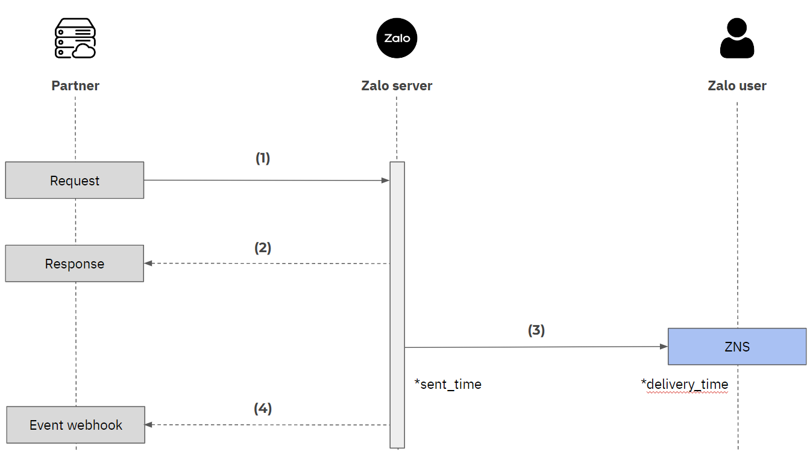

## Tổng quan

- Để có thể thực hiện gửi ZNS API, cần có Access Token (Mã định danh để gửi ZNS). ZNS cung cấp 2 phương thức để lấy Access token gồm công cụ <ins>[API explorer](https://developers.zalo.me/docs/api/official-account-api/xac-thuc-va-uy-quyen/cach-2-xac-thuc-voi-cong-cu-api-explorer/phuong-thuc-lay-oa-access-token-su-dung-cong-cu-api-explorer-post-5004)</ins> hoặc <ins>[giao thức OAuth](https://developers.zalo.me/docs/api/official-account-api/xac-thuc-va-uy-quyen/cach-1-xac-thuc-voi-giao-thuc-oauth/yeu-cau-cap-moi-oa-access-token-post-4307)</ins>

- Các Template để gửi ZNS cần được khởi tạo trước khi sử dụng. Chi tiết các bước tạo Template có thể xem chi tiết <ins>[tại đây](https://zalo.cloud/blog/huong-dan-tao-mau-thong-bao-zns/aeubd8edy4g6bggevv)</ins>

## Các bước gửi ZNS API

Để thực hiện gửi ZNS API và quản lý trạng thái thông tin ZNS, thực hiện các bước sau:



### (1) Gửi ZNS API

Để thực hiện gửi ZNS thông qua API, request cần bao gồm các thông tin sau:

| Tham số                             | Mô tả                                                                                                                                                                                                                                                                |
| ----------------------------------- | -------------------------------------------------------------------------------------------------------------------------------------------------------------------------------------------------------------------------------------------------------------------- |
| _access_token_                      | Cần có đoạn mã để xác thực quyền truy cập API. Xem thêm <ins>[tại đây](https://developers.zalo.me/docs/api/official-account-api/phu-luc/official-account-access-token-post-4307)</ins> để biết chi tiết.                                                             |
| _phone_                             | Số điện thoại của người dùng mà Doanh nghiệp muốn gửi ZNS tới. <br /> Lưu ý: Số điện thoại phải liên kết với tài khoản Zalo và được viết dưới dạng chuẩn hóa theo mã quốc gia. (Ví dụ: Số điện thoại 0987654321 viết theo định dạng chuẩn tiếng Việt là 84987654321) |
| _template_id_                       | ID của template muốn sử dụng.                                                                                                                                                                                                                                        |
| _template_data_                     | Các thuộc tính của template mà đối tác đã đăng ký với Zalo. <br/> **Lưu ý:** Cấu trúc _template_data_ được quy định riêng ứng với từng template.                                                                                                                     |
| _tracking_id_ <br/>(không bắt buộc) | Mã số đánh dấu lần gọi API của đối tác, do Doanh nghiệp định nghĩa. Doanh nghiệp có thể dùng _tracking_id_ để đối soát mà không phụ thuộc vào _message_id_ của Zalo cung cấp.                                                                                        |

**Example request**

```curl
curl
-X POST
-H "Content-Type: application/json" -d '{
    "phone": "84987654321",
    "template_id": "7895417a7d3f9461cd2e",
    "template_data": {
        "ky": "1",
        "thang": "4/2020",
        "start_date": "20/03/2020",
        "end_date": "20/04/2020",
        "customer": "Nguyễn Thị Hoàng Anh",
        "cid": "PE010299485",
        "address": "VNG Campus, TP.HCM",
        "amount": "100",
        "total": "100000",
 	},
    "tracking_id":"tracking_id"
}' "https://business.openapi.zalo.me/message/template"
```

### (2) Response

Sau khi yêu cầu được gửi đi, máy chủ Zalo sẽ phản hồi với các thông tin sau:

| Tham số     | Mô tả                                                                                                                                                                                   |
| ----------- | --------------------------------------------------------------------------------------------------------------------------------------------------------------------------------------- |
| _error_     | 0 nếu request thành công <br />ngược lại, xem Error Code chi tiết <ins>[tại đây](https://developers.zalo.me/docs/api/zalo-notification-service-api/phu-luc/bang-ma-loi-post-5233)</ins> |
| _message_   | Mô tả của lỗi tương ứng                                                                                                                                                                 |
| _msg_id_    | ID của tin ZNS <br /> _Lưu ý: chỉ trả về nếu yêu cầu thành công_                                                                                                                        |
| _sent_time_ | Thời gian máy chủ Zalo bắt đầu gửi ZNS (Định dạng timestamp)                                                                                                                            |
| _quota_     | Thông tin quota của OA <br /> _Lưu ý: chỉ trả về nếu yêu cầu thành công_                                                                                                                |

**Example response**

```
{
    "error": 0,
    "message": "Success",
    "data": {
       	"msg_id": "a4d0243feee163bd3af2"
         	"sent_time": "1626926349402",
         	"quota": {
                "dailyQuota": "500",
                "remainingQuota": "499"
         	}
    }
}
```

Xem chi tiết hơn về cấu trúc của request và response <ins>[tại đây](https://developers.zalo.me/docs/api/zalo-notification-service-api/gui-zns/gui-zns-post-5208)</ins>

### (3) Sự kiện gửi ZNS

Nếu request thành công, tin ZNS sẽ được gửi tới người dùng:

- **sent_time:** Thời điểm máy chủ Zalo bắt đầu gửi ZNS.
- **delivery_time:** Thời gian người dùng nhận được ZNS trên thiết bị.

### (4) Sự kiện người dùng nhận được tin ZNS

Nếu ZNS được gửi thành công trên thiết bị của người dùng, thì một sự kiện sẽ được gửi tới URL webhook của Doanh nghiệp.

| Tham số         | Mô tả                                                                               |
| --------------- | ----------------------------------------------------------------------------------- |
| _sender_        | ID của Official Account gửi thông báo                                               |
| _recipient_     | Số điện thoại người dùng nhận thông báo                                             |
| _event_name_    | Tên sự kiện: user_received_message                                                  |
| _delivery_time_ | Thời gian trên thiết bị người dùng nhận được ZNS                                    |
| _msg_id_        | ID của tin ZNS <br />_Lưu ý: chỉ trả về nếu yêu cầu thành công_                     |
| _tracking_id_   | Mã số đánh dấu lần gọi API của đối tác, do đối tác định nghĩa ở <ins>bước (1)</ins> |
| _app_id_        | ID của ứng dụng gửi tin (ứng dụng mà OA đã cấp quyền)                               |
| _timestamp_     | Thời điểm gửi sự kiện                                                               |

Xem thêm chi tiết sự kiện <ins>[tại đây.](https://developers.zalo.me/docs/api/zalo-notification-service-api/webhook/su-kien-nguoi-dung-nhan-thong-bao-zns-post-5235)</ins>
