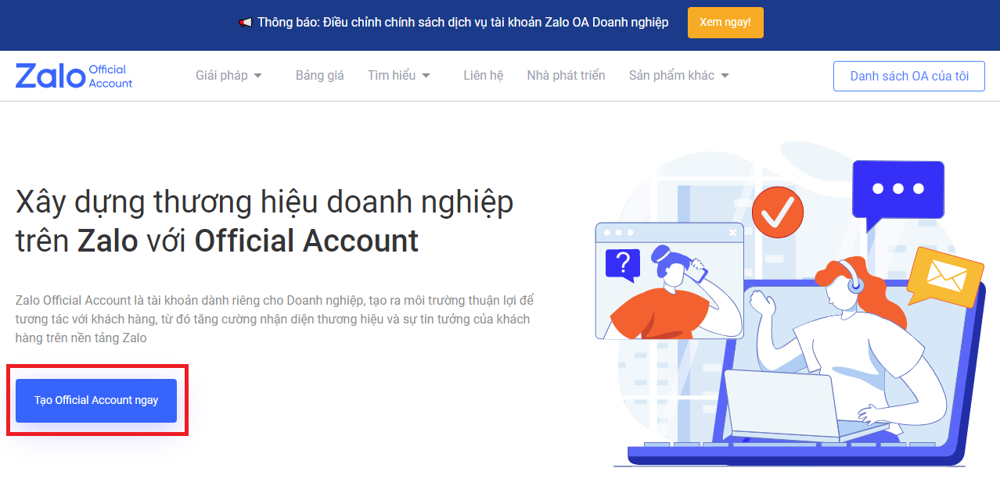

## Bước 1: Đăng ký tài khoản Zalo Official Account (OA)

Doanh nghiệp truy cập vào [trang chủ](https://oa.zalo.me/home) của Zalo Official Account (OA) và nhấp chọn “Tạo Official Account ngay" để đăng ký tài khoản OA.

_Chọn “Tạo Official Account ngay” để đăng ký tài khoản Zalo OA_

**Lưu ý:** Tên OA sẽ là brandname hiển thị của Doanh nghiệp tới người dùng Zalo

_Xem hướng dẫn chi tiết đăng ký tài khoản Zalo OA [tại đây](https://oa.zalo.me/home/resources/guides/huong-dan-dang-ky-tai-khoan-zalo-official-account-doanh-nghiep_61)._

## Bước 2: Xác thực tài khoản OA

Doanh nghiệp truy cập trang quản lý Official Account để thực hiện các bước xác thực tài khoản tại trang <ins>[quản lý OA](https://oa.zalo.me/manage/oa)</ins> để gửi hồ sơ xác thực.

**Lưu ý:** Tên OA cần trùng khớp với thông tin Doanh nghiệp cung cấp trong hồ sơ xác thực

_Xem chi tiết hướng dẫn xác thực tài khoản OA Doanh nghiệp [tại đây.](https://oa.zalo.me/home/resources/guides/huong-dan-xac-thuc-tai-khoan-official-account-doanh-nghiep_70)_

## Bước 3: Tạo ứng dụng và liên kết ứng dụng với OA

_\*Doanh nghiệp có thể bỏ qua bước này nếu gửi tin ZNS thông qua đại lý được ủy quyền hoặc đã có Ứng dụng được cấp quyền trước đó._

Doanh nghiệp vào trang <ins>[Tạo ứng dụng mới](https://developers.zalo.me/createapp)</ins>, đăng nhập tài khoản Zalo và tạo ứng dụng để sử dụng API.

Sau khi tạo ứng dụng, có thể liên kết ứng dụng với OA để gửi tin ZNS và nhận các thông báo về tình trạng gửi tin ZNS của OA.

1. Nhấp chọn “Official Account” dưới mục “Sản phẩm”

2. Kiểm tra mục Liên kết với OA mà doanh nghiệp muốn sử dụng để gửi tin ZNS và nhận thông báo.

## Bước 4: Ủy quyền ứng dụng gửi ZNS

_\* Doanh nghiệp có thể bỏ qua bước này nếu gửi tin ZNS thông qua đại lý được ủy quyền_

Để sử dụng được ZNS API, ứng dụng cần được OA xác thực và ủy quyền để thực hiện gửi ZNS và các phương thức khác.

Có hai phương thức thực hiện xác thực và uỷ quyền

- Sử dụng công cụ <ins>[API explorer](https://developers.zalo.me/docs/api/official-account-api/xac-thuc-va-uy-quyen/cach-2-xac-thuc-voi-cong-cu-api-explorer/phuong-thuc-lay-oa-access-token-su-dung-cong-cu-api-explorer-post-5004)</ins>
- Sử dụng <ins>[giao thức OAuth](https://developers.zalo.me/docs/api/official-account-api/xac-thuc-va-uy-quyen/cach-1-xac-thuc-voi-giao-thuc-oauth/yeu-cau-cap-moi-oa-access-token-post-4307)</ins>

## Bước 5: Tạo và liên kết tài khoản Zalo Cloud Account

_\*Doanh nghiệp có thể bỏ qua bước này nếu gửi tin ZNS thông qua đại lý được ủy quyền_

Tạo và liên kết Zalo Cloud Account (ZCA) để quản lý các lịch sử giao dịch và tài sản của OA bằng cách truy cập vào <ins>[trang quản lý tài khoản ZCA](https://account.zalo.cloud/account/create)</ins> làm theo hướng dẫn

_Xem chi tiết các bước tạo tài khoản ZCA <ins>[tại đây](https://oa.zalo.me/home/resources/guides/huong-dan-tao-zalo-cloud-account_75)</ins>._

Cần liên kết tài khoản OA đã xác thực với tài khoản ZCA đã đăng ký ở Bước 5 để quản lý các lịch sử giao dịch và tài sản của doanh nghiệp.

_Xem chi tiết các bước liên kết <ins>[tại đây.](https://zalo.cloud/blog/zalo-oa-xac-thuc-la-gi-huong-dan-lien-ket-zalo-oa-vao-tai-khoan-zca-/kguqjeadm9y4bnaya)</ins>_

## Bước 6: Nạp tiền vào tài khoản ZCA

_\*Doanh nghiệp có thể bỏ qua bước này nếu gửi tin ZNS thông qua đại lý được ủy quyền_

ZNS là dịch vụ gửi thông báo có tính phí, do đó đối với các tài khoản ZCA thông thường, Doanh nghiệp vui lòng nạp tiền trả trước tại <ins>[trang chủ ZCA](https://account.zalo.cloud/topup)</ins>

_Xem chi tiết hướng dẫn nạp tiền <ins>[tại đây](https://zalo.cloud/blog/huong-dan-nap-tien-vao-tai-khoan-zalo-cloud-account-zca-/dbuegyjqepvn9gk79q)</ins>._

## Bước 7: Tạo mẫu thông báo ZNS

Để gửi thông báo ZNS đến người dùng, Doanh nghiệp cần tạo mẫu tin ZNS và gửi yêu cầu phê duyệt trước khi có thể sử dụng.

_Xem chi tiết tạo mẫu thông báo ZNS <ins>[tại đây](https://zalo.cloud/blog/huong-dan-tao-mau-thong-bao-zns/aeubd8edy4g6bggevv)</ins>_

## Bước 8: Gửi thông báo ZNS

Có hai hình thức gửi ZNS:

- [Gửi thông qua API](/zns-api)

- [Gửi thông qua công cụ “Gửi theo chiến dịch” trên ZCA](https://zalo.cloud/blog/huong-dan-su-dung-tinh-nang-gui-zns-khong-can-thong-qua-api-/pdujnyqpydqrepnq)

Doanh nghiệp có thể tham khảo sự khác biệt giữa hai hình thức gửi ZNS <ins>[tại đây](https://zalo.cloud/blog/so-sanh-gui-thong-bao-zns-qua-api-va-khong-qua-api-gui-theo-chien-dich-/nauqwpyy979a98kbqw)</ins> để lựa chọn phương thức gửi phù hợp với chiến lược kinh doanh của mình.

Vậy là doanh nghiệp vừa hoàn thành những bước để có thể tiến hành gửi thông báo ZNS đến khách hàng. Nếu cần hỗ trợ trong quá trình đăng ký sử dụng dịch vụ ZNS, Doanh nghiệp có thể liên hệ với đội ngũ hỗ trợ và chăm sóc khách hàng của Zalo Cloud qua email: **support@zalo.cloud**
