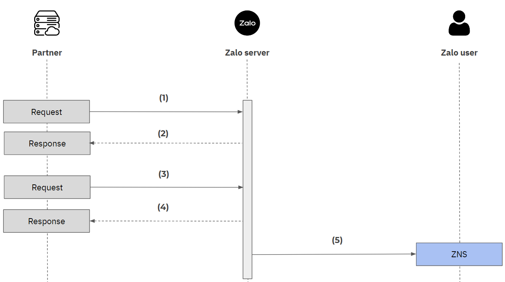

## Tổng quan

- ZNS Journey là một chuỗi các tin ZNS được gửi đến người dùng Zalo, được áp dụng cơ chế tính phí riêng để tối ưu chi phí cho đối tác trong việc gửi tin ZNS với các use-cases như theo hóa đơn tiền điện nước, hành trình giao vận hoặc mua hàng so với gửi từng tin ZNS riêng lẻ.

- Để có thể thực hiện gửi ZNS journey cần phải có Journey token (Journey token như một định danh để gửi ZNS).

- Các mẫu (template) để gửi ZNS Journey cần được khởi tạo trước theo luồng riêng (thông qua Bộ phận CSKH tại [Zalo Official Account](https://oa.zalo.me/4462152339089565647)/[kênh email](https://zalooa.freshdesk.com/support/tickets/new/))

## Gửi ZNS Journey

Để gửi ZNS Journey, cần thực hiện các bước sau:



### (1) Khởi tạo Journey token

Gửi request đến server Zalo để khởi tạo Journey token, bao gồm các thông tin bắt buộc:

| Parameter      | Mô tả                                                                                                                                                                                          |
| -------------- | ---------------------------------------------------------------------------------------------------------------------------------------------------------------------------------------------- |
| _access_token_ | Đoạn mã cần truyền vào để xác minh quyền sử dụng API. Xem thêm [tài liệu tham khảo](https://developers.zalo.me/docs/api/official-account-api/phu-luc/official-account-access-token-post-4307). |
| _phone_        | Số điện thoại của người nhận.                                                                                                                                                                  |

**Example request**

```
curl --location
--request POST 'https://business.openapi.zalo.me/journey/get-token'
--header 'Content-Type: application/json'
--header 'access_token: your_access_token'
--data-raw '{ "phone":"84987654321" }'
```

### (2) Response

Sau khi request, server Zalo phản hồi các thông tin sau:

| Parameter    | Mô tả                                                                                                                                                                             |
| ------------ | --------------------------------------------------------------------------------------------------------------------------------------------------------------------------------- |
| _error_      | error = 0 nếu request thành công và ngược lại. Chi tiết <ins>[Error code](https://developers.zalo.me/docs/api/zalo-notification-service-api/phu-luc/bang-ma-loi-post-5233)</ins>. |
| _message_    | Mô tả của mã lỗi tương ứng                                                                                                                                                        |
| _token_      | Mã journey token được kích hoạt \n Note: chỉ được trả về nếu request thành công                                                                                                   |
| _journey_id_ | ID của Journey                                                                                                                                                                    |

**Example response**

```
{
    "error": 0,
    "message": "Success",
    "token": "8iCeIhJbTcPtLo0Kh1kS6rOVXl0Rgv2wZNPRaW61sKQaXTGth1KrhGwQrDVXHnJbckzcL8fG-k_X0h1IL-SyeBPfCtwyljtiKutpUQvih7P65AgvJiz9fYYSHkrdrVNuCdPAMeVCYgERu3UWmQOjKMfLWsII_u5E9ylCO46Z-_mFSJC7DstAkBxFVcJTlzduNMsQzxBVaUom9E_06p1cw7DKRtGjLAF0jkfKgj0ftMI=",
    "journey_id": "123456789"
}
```

_\* Lưu ý: **journey_token** chỉ tồn tại trong 7 ngày từ thời điểm được kích hoạt_
Xem thêm cấu trúc của request và response tại <ins>[đây](https://developers.zalo.me/docs/api/zalo-notification-service-api/gui-zns/gui-zns-journey-post-6350)</ins>

### (3) Gửi ZNS với Journey token

Sử dụng Journey token được phản hồi ở bước (2) để gửi ZNS. Cần truyền vào các thông tin bắt buộc sau:

| Parameter       |                                                                         Mô tả                                                                          |
| :-------------- | :----------------------------------------------------------------------------------------------------------------------------------------------------: |
| _access_token_  |                                                  Đoạn mã cần truyền vào để xác minh quyền sử dụng API                                                  |
| _journey_token_ |                                                    Đoạn mã xác minh ZNS Journey vừa được kích hoạt                                                     |
| _phone_         | Số điện thoại của người nhận mẫu tin <br/> _**Lưu ý:** SĐT phải được liên kết với tài khoản Zalo và được viết ở định dạng chuẩn hóa theo mã quốc gia._ |
| _template_id_   |              ID của template ZNS muốn sử dụng. Đối với ZNS được gửi bằng Journey token, cần sử dụng mẫu template riêng mà Zalo cung cấp.               |
| _template_data_ |                                               Các thuộc tính của template mà đối tác đã đăng ký với Zalo                                               |

**Example request**

```
curl --location
--request POST 'https://business.openapi.zalo.me/message/template'
--header 'Content-Type: application/json'
--header 'access_token: your_access_token'
--header 'journey_token: 8iCeIhJbTcPtLo0Kh1kS6rOVXl0Rgv2wZNPRaW61sKQaXTGth1KrhGwQrDVXHnJbckzcL8fG-k_X0h1IL-SyeBPfCtwyljtiKutpUQvih7P65AgvJiz9fYYSHkrdrVNuCdPAMeVCYgERu3UWmQOjKMfLWsII_u5E9ylCO46Z-_mFSJC7DstAkBxFVcJTlzduNMsQzxBVaUom9E_06p1cw7DKRtGjLAF0jkfKgj0ftMI='
--data-raw
'{
    "template_data": {
    },
    "phone": "84987654321",
   "template_id":217489
}'
```

### (4) Response

Sau khi request gửi ZNS với journey token ở bước (3), tùy theo trạng thái của tin gửi sẽ nhận lại phản hồi tương ứng từ server Zalo.

| Parameter        |                                                                                       Mô tả                                                                                       |
| :--------------- | :-------------------------------------------------------------------------------------------------------------------------------------------------------------------------------: |
| _error_          | error = 0 nếu request thành công và ngược lại. Chi tiết <ins>[Error code.](https://developers.zalo.me/docs/api/zalo-notification-service-api/phu-luc/bang-ma-loi-post-5233)</ins> |
| _message_        |                                                                            Mô tả của mã lỗi tương ứng                                                                             |
| _msg_id_         |                                                  ID của thông báo ZNS.<br/> _Note: only available if the request is successful_                                                   |
| _sent_time_      |                                                           Thời gian Zalo server gửi thông báo ZNS (Định dạng timestamp)                                                           |
| _remainingQuota_ |                                      Số lượng tin ZNS có thể gửi còn lại trong 1 ngày. <br />_ Note: chỉ được trả về nếu request thành công_                                      |
| _dailyQuota_     |                                          Số lượng tin ZNS có thể gửi trong 1 ngày. <br />_ Note: chỉ được trả về nếu request thành công_                                          |

**Example response**

```
{
    "error": 0,
    "message": "Success",
    "data": {
        "sent_time": "1640144305350",
        "quota": {
            "remainingQuota": "480",
            "dailyQuota": "500"
        },
        "msg_id": "6e84304c259208ce5181"
    }
}

```

### (5) ZNS được gửi đến thiết bị người nhận

_Chi tiết các thiết lập và các example request: <ins>[Xem tại tài liệu tham khảo.](https://developers.zalo.me/docs/api/zalo-notification-service-api/gui-zns/gui-zns-journey-post-6350)</ins>_

## Kiểm tra Journey Token

Để có thể kiểm tra thông tin của Journey Token, sử dụng API như sau

### (1) Request

| Parameter       | Mô tả                                                |
| --------------- | ---------------------------------------------------- |
| _access_token_  | Đoạn mã cần truyền vào để xác minh quyền sử dụng API |
| _journey_token_ | Đoạn mã xác minh ZNS Journey vừa được kích hoạt      |

**Example request**

```
curl --location --request GET 'https://business.openapi.zalo.me/journey/check-token' \
--header 'Content-Type: application/json' \
--header 'access_token: access_token' \
--header 'journey_token: journey_token'
```

### (2) Response

Sau khi request với access_token và journey_token, Zalo sẽ trả về response tương ứng với các trường thông tin

| Parameter    | Mô tả                                                         |
| ------------ | ------------------------------------------------------------- |
| _created_at_ | Thời gian tạo Journey Token (Định dạng Timestamp)             |
| _expired_at_ | Thời gian Journey Token hết hạn sử dụng (Định dạng Timestamp) |
| _app_id_     | ID của ứng dụng                                               |
| _oa_id_      | ID của OA                                                     |

**Example response**

```
{
    "error": 0,
    "message": "Success",
    "data": {
        "appId": "4349311699477619340",
        "oaId": "3886651700907664415",
        "createdAt": "1641269204370",
        "expiredAt": "1641269384370"
    }
}
```

Xem chi tiết response tại [đây](https://developers.zalo.me/docs/api/zalo-notification-service-api/gui-zns/gui-zns-journey-post-6350#:~:text=v%E1%BB%ABa%20k%C3%ADch%20ho%E1%BA%A1t-,Example%20respond,-1)
